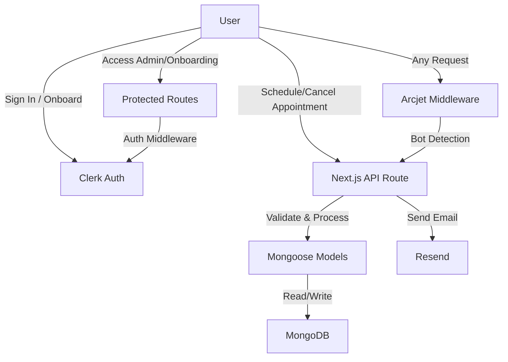

# Patient Management App


A modern, full-stack patient management system built with Next.js, React, MongoDB, and TailwindCSS. This application streamlines patient onboarding, appointment scheduling, and administrative workflows for healthcare providers. It features secure authentication, robust bot protection, real-time notifications, and a responsive, accessible UI.

---

## Table of Contents

- [Features](#features)
- [Architecture Overview](#architecture-overview)
- [Tech Stack & Dependencies](#tech-stack--dependencies)
- [Folder Structure](#folder-structure)
- [Data Models](#data-models)
- [API Endpoints](#api-endpoints)
- [Data Flow Diagram](#data-flow-diagram)
- [Setup Instructions](#setup-instructions)
- [Contributing](#contributing)
- [Acknowledgements](#acknowledgements)

---

## Features

- **User Authentication & Onboarding:** Secure sign-in and onboarding flows powered by Clerk.
- **Admin Dashboard:** Manage patients, appointments, and view statistics in a protected admin area.
- **Patient Appointment Scheduling:** Patients can book, view, and cancel appointments with real-time feedback.
- **Email Notifications:** Automated emails for appointment confirmations, cancellations, and reminders (Resend).
- **Bot Detection & Security:** Arcjet middleware protects all routes and APIs from bots and malicious actors.
- **Responsive UI:** Built with TailwindCSS and Radix UI for accessibility and mobile-friendliness.
- **Data Modeling:** MongoDB and Mongoose for flexible, scalable data storage.
- **Statistics & Analytics:** Visualize appointment and patient data for better decision-making.
- **Reusable Components:** Modular React components for rapid development and maintainability.

---

## Architecture Overview

- **Frontend:** Next.js App Router, React components, TailwindCSS for styling, Radix UI for accessible primitives.
- **Backend:** Next.js API routes handle business logic, validation, and database operations.
- **Database:** MongoDB (via Mongoose) stores users, appointments, and onboarding data.
- **Authentication:** Clerk provides secure, session-based authentication and user management.
- **Bot Protection:** Arcjet middleware inspects all requests for bot activity and blocks as needed.
- **Email Service:** Resend is used for transactional emails (appointment confirmations, etc).

---

## Tech Stack & Dependencies

- **Frontend:** Next.js, React, TailwindCSS, Radix UI, Lucide Icons
- **Backend:** Next.js API routes, MongoDB, Mongoose
- **Authentication:** Clerk
- **Bot Protection:** Arcjet
- **Email:** Resend
- **Utilities:** date-fns, clsx, class-variance-authority, react-hot-toast

<details>
<summary>Click to view all dependencies</summary>

- @arcjet/next
- @clerk/nextjs
- @radix-ui/react-dialog, @radix-ui/react-label, @radix-ui/react-popover, @radix-ui/react-select, @radix-ui/react-slot
- class-variance-authority, clsx
- date-fns
- lucide-react
- mongodb, mongoose
- motion
- react-day-picker
- react-hot-toast
- resend
- tailwind-merge, tailwindcss, @tailwindcss/postcss
- vaul
- tw-animate-css
</details>

---

## Folder Structure

```plaintext
patient-management-app/
│
├── app/                  # Next.js app directory (routing, pages, API)
│   ├── (auth)/           # Authentication pages (sign-in, multi-step onboarding)
│   ├── (routes)/         # Main app routes (admin dashboard, onboarding, success)
│   ├── api/              # API endpoints (appointments, users, notifications)
│   ├── favicon.ico
│   ├── globals.css       # Global styles (TailwindCSS)
│   ├── layout.js         # Root layout and providers
│   ├── loading.js        # Global loading spinner
│   ├── navbar.js         # Navigation bar
│   └── page.js           # Home page
│
├── components/           # Reusable React components
│   ├── appointment-form-layout.jsx
│   ├── appointment-form.jsx
│   ├── appointment-statistics.jsx
│   ├── cards.jsx
│   ├── onboarding-form-layout.jsx
│   ├── onboarding-form.jsx
│   ├── patient-table.jsx
│   ├── cancel-appointment/   # Cancel appointment UI (desktop/mobile)
│   ├── email/               # Email templates (React components)
│   ├── magicui/             # Animated text and UI effects
│   ├── schedule-appointment/# Schedule appointment UI (desktop/mobile)
│   └── ui/                  # UI primitives (button, dialog, input, etc.)
│
├── data/                 # Static data (doctors.js)
├── db/                   # Database connection (mongodb.js)
├── lib/                  # Utility functions (utils.js)
├── model/                # Mongoose models (appointment, user)
├── public/               # Static assets (SVGs, images)
├── utils/                # App-specific utilities (actions, metadata)
│
├── middleware.js         # Middleware for auth and bot protection
├── next.config.mjs       # Next.js configuration
├── package.json
├── postcss.config.mjs
├── tailwind.config.js
└── README.md
```

---

## Data Models

### User Model (`model/user.model.js`)
- **Fields:**
  - `name`, `email`, `password` (hashed), `role` (admin/patient), `onboardingStatus`, etc.
- **Purpose:**
  - Stores user credentials, roles, and onboarding progress.
  - Used for authentication, authorization, and personalized onboarding.

### Appointment Model (`model/appointment.model.js`)
- **Fields:**
  - `patientId`, `doctorId`, `date`, `time`, `status`, `notes`, etc.
- **Purpose:**
  - Stores all appointment details, links to patient and doctor, tracks status (scheduled/cancelled/completed).
  - Used for scheduling, reminders, and analytics.

---

## API Endpoints

- `POST /api/create-user` — Register a new user (patients or admins)
- `POST /api/create-appointment` — Schedule a new appointment
- `GET /api/get-appointments` — Retrieve all appointments (admin) or user-specific (patient)
- `POST /api/cancel-appointment/send` — Cancel an appointment and notify
- `POST /api/schedule-appointment/send` — Send appointment schedule notification

**All API routes are protected by Arcjet (bot detection) and Clerk (authentication) unless explicitly public.**

---

## Data Flow Diagram



---

## Setup Instructions

1. **Clone the repository:**
   ```bash
   git clone https://github.com/your-username/patient-management-app.git
   cd patient-management-app
   ```

2. **Install dependencies:**
   ```bash
   npm install
   # or
   yarn install
   # or
   bun install
   ```

3. **Configure environment variables:**
   - Create a `.env.local` file in the root directory.
   - Add your MongoDB URI, Clerk keys, Arcjet key, and Resend API key:
     ```env
     MONGODB_URI=your_mongodb_uri
     CLERK_PUBLISHABLE_KEY=your_clerk_publishable_key
     CLERK_SECRET_KEY=your_clerk_secret_key
     ARCJET_KEY=your_arcjet_key
     RESEND_API_KEY=your_resend_api_key
     ```
   - _Never commit your `.env.local` file to version control._

4. **Run the development server:**
   ```bash
   npm run dev
   # or
   yarn dev
   # or
   bun dev
   ```

5. **Open the app:**
   - Visit [http://localhost:3000](http://localhost:3000) in your browser.

6. **Production build:**
   ```bash
   npm run build && npm start
   ```

---

## Contributing

Contributions are welcome! Please open issues or submit pull requests for improvements, bug fixes, or new features.

1. Fork the repository
2. Create a new branch (`git checkout -b feature/your-feature`)
3. Commit your changes (`git commit -am 'Add new feature'`)
4. Push to the branch (`git push origin feature/your-feature`)
5. Open a Pull Request

---

## Acknowledgements

- [Next.js](https://nextjs.org/) — React framework for production
- [Clerk](https://clerk.com/) — Authentication and user management
- [Arcjet](https://arcjet.com/) — Bot detection and security
- [MongoDB](https://mongodb.com/) — NoSQL database
- [Resend](https://resend.com/) — Email sending service
- [TailwindCSS](https://tailwindcss.com/) — Utility-first CSS framework
- [Radix UI](https://www.radix-ui.com/) — Primitives for building accessible UI components
- [date-fns](https://date-fns.org/) — Modern JavaScript date utility library
- [Lucide Icons](https://lucide.dev/) — Beautiful & consistent icon toolkit

---

> _This project is licensed under the MIT License. Contributions are welcome!_
